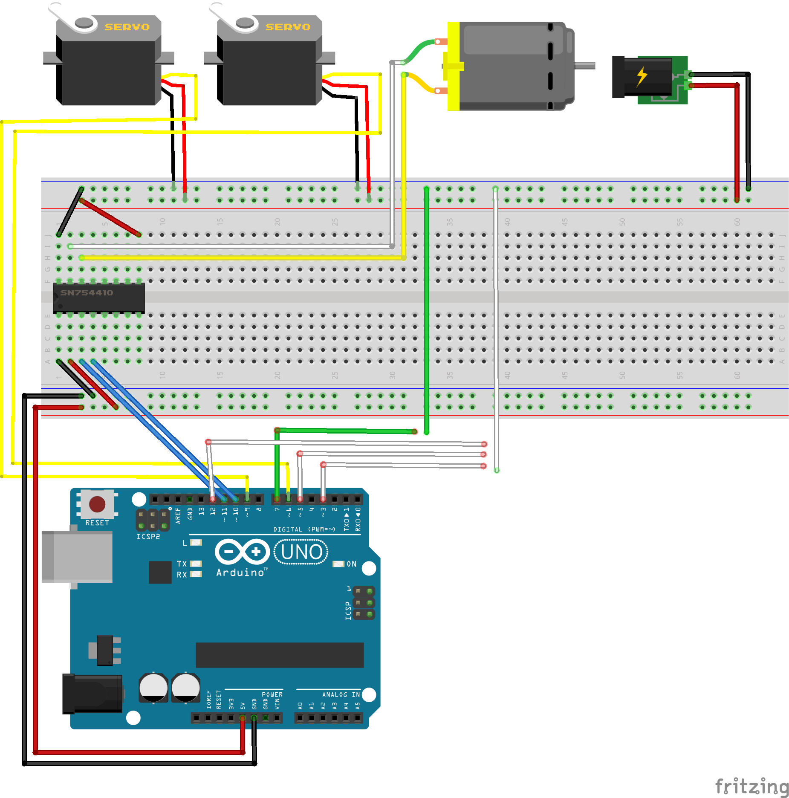

# Snails

During the practical course Sketching with Hardware at LMU we worked on a project called snails. You can find the description of our work on the [blog](http://blog.medien.ifi.lmu.de/swh/).

Here we want to publish any additional information you might need to recreate our game (circuit, documented source code and the patterns we used for laser-cutting). We will also explain the two central components of our circuit:

## Gray Code Wheel

### General

Gray code is a form of binary code where only one digit at a time changes. So you never go from 1111 to 10000 or anything like that.

### Why we needed it

Hardware is a bit more sensitive than software. For our disc we had three tracks checking their contact with a copper tape. When the three copper wires are directly at the transition passage from one ‘number’ to the other, it needs to be ensured that only either the old or the new number is detected. If two digits change from one number to the other, one wire could already have contact with the new one, the other one still with the old one. Then an entirely different number suddenly occurs. With the Gray code though, only the new or the old number can be detected.

This might be more simple in an example:

Let’s say we have the numbers 011, followed by 100 in ‘traditional’ binary. If the first copper wire is already in contact with the second number, but wires two and three still in contact with the first, we get 111, which should not be detected.

Now we use Gray code. Here the number 011 is followed by 010. So if we have the same scenario as above (wire one in contact with the second number, wires two and three with the first) we get 011. This works with either combination. Always either the first or second number is detected, never any other.

### How we used it

We needed at least six different numbers for six different snails. Since Gray code is a form of binary, we then used the three bit Gray code, so we got eight numbers: 000, 001, 011, 010, 110, 111, 101, 100.

Then we fashioned the wheel with copper tape making sure the copper was in contact with the screw in the middle by using steel wool. At one point we needed to build a little ‘bridge’ so that all tape was in contact, but the link was not detected by just applying some non-conducting tape over it. In the end we linked the screw to the ‘ground’ of the Arduino and used three copper wires connected to three pins as ‘reader’ of the tracks.

You can see the pattern we used to laser-cut the wheel in [Graycode.pdf](Graycode.pdf).

## H-Bridge

### General

The H-Bridge enables a motor to move in different directions and vary its speed (the speed variation is achieved through the usage of the PWM pins of the Arduino to control the pulse-width). The bridge does not need to be an extra component like in our case. It can also just be built with two amplifier channels consisting of two MOS-FETs or power transistors each. There are two transistors with different polarity with each. Depending on which are turned on the two pins of the motor are connected to the power supply and the ground or visa versa. This way the motor can be moved forwards and backwards. The single component sure makes it a lot easier though.

### Why we needed it

In fact the H-Bridge just does exactly what we were looking for. We needed our motor to move both ways so it can drive the cart with the two servos to any position. In the end we didn’t really need the variation in speed, since the whole system worked fine on maximum speed. But at the point of the development we did not know that yet as we saw maximum speed and thought it was way to fast to be steered so accurately.

### How we used it

The component was rather easy to use as all pins were described on the bottom. So we only had to plug in the wires according to it (please take a look at the circuit diagram for the exact setting) and it worked perfectly. The only thing that you should keep in mind here is to make sure to use two PWM pins of the Arduino for this so that you can vary the motor’s speed and connect the Arduino’s ground with the ground of the external power source if you use one.